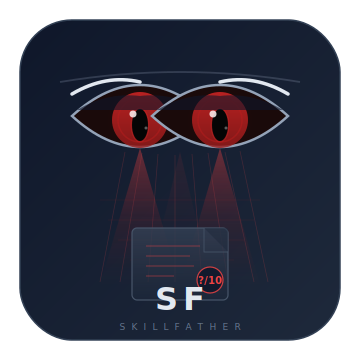

<p align="center">
  
</p>

<h2 align="center">SkillFather</h2>

<p align="center">
  <b>多平台 Agent Skill 适配度分析工具</b>
</p>

<p align="center">
  <a href="README.md">English</a> · <a href="docs/README_CN.md">简体中文</a>
</p>

<p align="center">
  
  
  
</p>

<p align="center">
  <b>别因为一个 Skill 看起来很酷就装它——先弄清楚它是不是为你而生。</b>
</p>

---

> **定位声明**：SkillFather 只做**适用性评审**（fitness/suitability assessment），从用户实际使用场景出发评估一个 Skill 是否适合安装和使用。**不涉及安全性审计、合规检查或代码漏洞分析。**

## 它能做什么

每个 Agent 平台都有丰富的 Skill 市场。有些 Skill 写得很棒——但对别人而言。SkillFather 读取 Skill 定义文件，向你提出正确的问题，从 5 个维度打分，让你**在安装之前**就知道它值不值得你花时间。

```
SKILL.md → 解析 → 生成 6-10 个诊断问题 → 5 维度评分 → 适配度 /10
```

### 5 大评分维度

| 维度 | 权重 | 评估内容 |
|------|------|---------|
| 用例契合度 | 25% | Skill 的触发场景是否覆盖你的实际需求？ |
| 环境就绪度 | 20% | 你的 Agent 环境是否具备所需工具、连接器和依赖？ |
| 前置条件 | 20% | 你是否满足 Skill 运行所需的先决条件和访问权限？ |
| 工作流匹配 | 20% | Skill 的执行流程是否符合你的实际操作习惯？ |
| 文档质量 | 15% | Skill 的文档是否清晰、完整、可操作？ |

### 支持平台

| 平台 | Skill 格式 | 存储路径 |
|------|-----------|---------|
| **WorkBuddy** | SKILL.md (YAML + Markdown) | `~/.workbuddy/skills/` |
| **CodeBuddy** | SKILL.md (YAML + Markdown) | `~/.codebuddy/skills/` |
| **OpenAI Codex Agent** | SKILL.md + agents/openai.yaml | `.agents/skills/` |
| **Claude Code** | .claude/commands/*.md | `.claude/commands/` |
| **Coze / 扣子** | .skill / .zip / JSON | Web UI + 导出文件 |
| **Hermes Agent** | SKILL.md (Hermes metadata) | `~/.hermes/skills/` |

## 快速开始

```bash
# 克隆并安装（零外部依赖）
git clone https://github.com/alpsmonkey/SkillFather.git
cd SkillFather
pip install -e .
```

### 基本用法

```bash
# 列出所有支持的平台
skillfather platforms

# 自动检测平台并分析
skillfather analyze path/to/SKILL.md

# 指定平台
skillfather analyze path/to/command.md --platform claude-code

# 交互式问答模式（获取个性化评分）
skillfather analyze path/to/SKILL.md --interactive

# 输出 HTML 报告
skillfather analyze path/to/SKILL.md --format html -o report.html

# 输出 Markdown 报告
skillfather analyze path/to/SKILL.md --format markdown -o report.md
```

### 各平台使用示例

```bash
# WorkBuddy / CodeBuddy
skillfather analyze ~/.workbuddy/skills/my-skill/SKILL.md
skillfather analyze ~/.codebuddy/skills/pdf-editor/SKILL.md --platform codebuddy

# OpenAI Codex Agent
skillfather analyze .agents/skills/deploy/SKILL.md --platform codex

# Claude Code
skillfather analyze .claude/commands/review.md --platform claude-code

# Coze / 扣子
skillfather analyze exported_skill.json --platform coze

# Hermes Agent
skillfather analyze ~/.hermes/skills/research/SKILL.md --platform hermes
```

## 双模式引擎

| 模式 | 说明 | 依赖 |
|------|------|------|
| **规则引擎** | 基于模板的离线分析，零配置 | 无（纯 stdlib） |
| **LLM 增强** | 使用大模型生成个性化问题和评分 | 任意 OpenAI 兼容 API |

### LLM 模式（可选）

```bash
# 通过环境变量设置 API Key
export SKILLFATHER_API_KEY=sk-xxx
skillfather analyze SKILL.md --llm --interactive

# 或使用自定义 API 端点
export SKILLFATHER_API_BASE=https://api.deepseek.com/v1
export SKILLFATHER_MODEL=deepseek-chat
skillfather analyze SKILL.md --llm --interactive
```

## 输出格式

### 终端输出

```
╔══════════════════════════════════════════════════╗
║  SkillFather — 适配度分析报告                    ║
╠══════════════════════════════════════════════════╣
║  Skill:   SAP 成本分析                            ║
║  平台:    workbuddy                               ║
║  评分:    7.2 / 10                                ║
║  结论:    推荐安装                                 ║
╠══════════════════════════════════════════════════╣
║  用例契合度       ████████░░  8.0/10             ║
║  环境就绪度       ██████░░░░  6.0/10             ║
║  前置条件         ███████░░░  7.0/10             ║
║  工作流匹配       ████████░░  7.5/10             ║
║  文档质量         ███████░░░  7.0/10             ║
╚══════════════════════════════════════════════════╝
```

### HTML 报告

生成带可视化评分的响应式 HTML 报告：

```bash
skillfather analyze SKILL.md --format html -o report.html
```

### Markdown 报告

适合笔记或分享：

```bash
skillfather analyze SKILL.md --format markdown -o report.md
```

## 配置

### 环境变量

| 变量 | 说明 | 默认值 |
|------|------|--------|
| `SKILLFATHER_API_KEY` | LLM API Key | 无（仅规则模式） |
| `SKILLFATHER_API_BASE` | API Base URL | `https://api.openai.com/v1` |
| `SKILLFATHER_MODEL` | LLM 模型名 | `gpt-4o-mini` |
| `SKILLFATHER_CONFIG` | 配置文件路径 | 无 |

### JSON 配置文件（可选）

在项目根目录创建 `skillfather.json` 或通过 `SKILLFATHER_CONFIG` 指定：

```json
{
  "llm": {
    "enabled": true,
    "api_key": "sk-xxx",
    "api_base": "https://api.openai.com/v1",
    "model": "gpt-4o-mini"
  },
  "analysis": {
    "num_questions": 10,
    "score_weights": {
      "use_case": 0.25,
      "environment": 0.2,
      "prerequisites": 0.2,
      "workflow": 0.2,
      "documentation": 0.15
    }
  }
}
```

## 项目结构

```
SkillFather/
├── src/skillfather/
│   ├── __init__.py
│   ├── __main__.py
│   ├── cli.py              # CLI 入口（多平台支持）
│   ├── parser.py           # 通用 Skill 解析器
│   ├── analyzer.py         # 分析引擎（规则 + LLM）
│   ├── reporter.py         # HTML / Markdown 报告
│   ├── config.py           # 配置管理
│   └── platforms/          # 多平台适配器
│       ├── __init__.py     # 平台注册与自动检测
│       ├── base.py         # 适配器基类
│       ├── workbuddy.py    # WorkBuddy
│       ├── codebuddy.py    # CodeBuddy
│       ├── codex.py        # OpenAI Codex Agent
│       ├── claude_code.py  # Claude Code
│       ├── coze.py         # Coze / 扣子
│       └── hermes.py       # Hermes Agent
├── templates/
│   └── report.html         # HTML 报告模板
├── examples/              # 各平台示例文件
│   ├── sample_skill.md
│   ├── sample_codex_skill.md
│   ├── sample_claude_command.md
│   ├── sample_coze_skill.json
│   └── sample_hermes_skill.md
├── tests/
│   └── test_parser.py
├── docs/
│   └── README_CN.md        # 中文 README（本文件）
├── README.md               # English README
├── LICENSE
├── pyproject.toml
└── requirements.txt
```

## 为什么叫 "Father"？

每个 Skill 都有它的创造者，但没人告诉你它是不是为**你**而造的。SkillFather 是那个裁判——它读懂细则，提出尖锐的问题，给你一个可信的数字。

> 聪明地安装。而不是更多。

## 许可证

[MIT](LICENSE) — 随便用、随便改、随便发。
